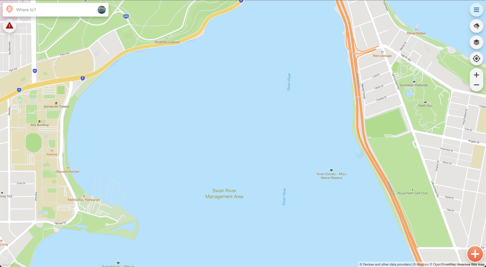
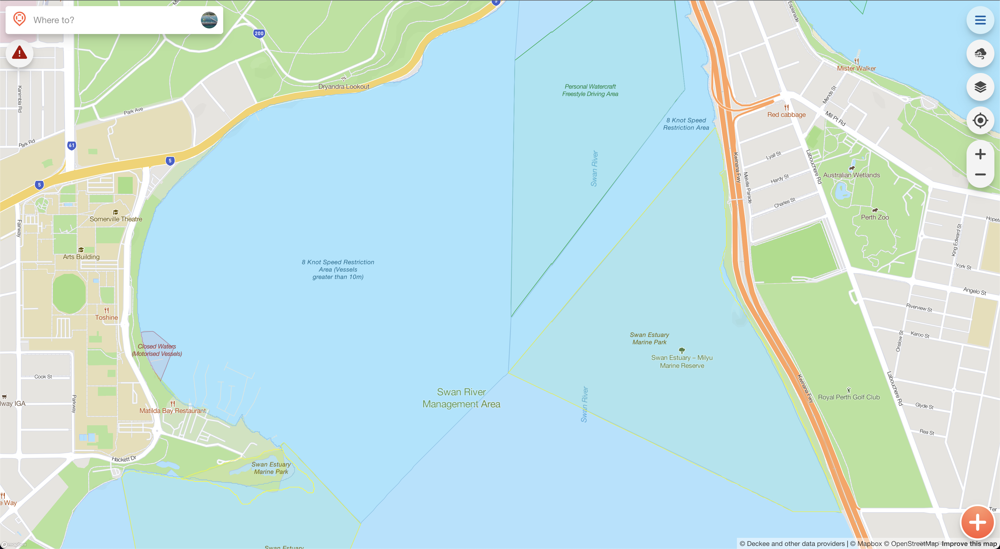
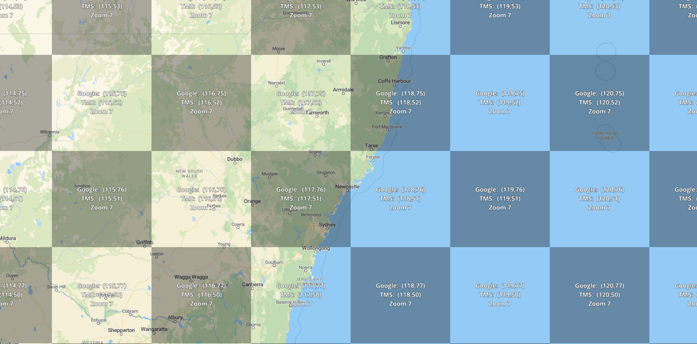
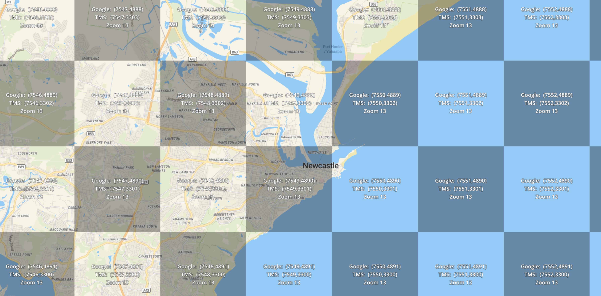
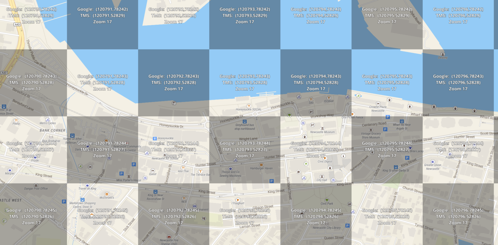
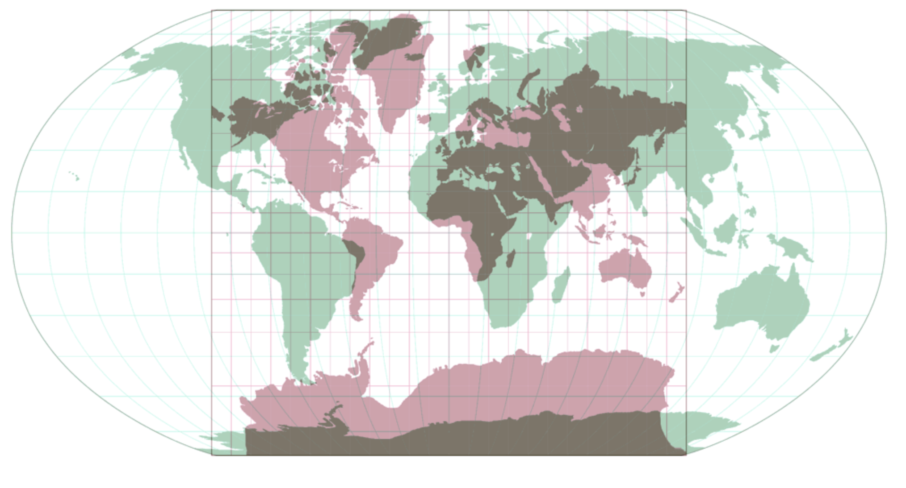
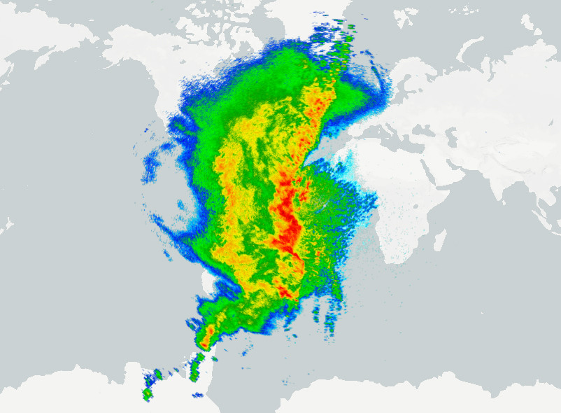
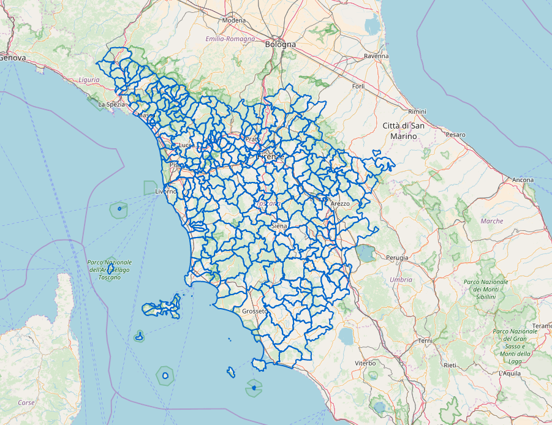
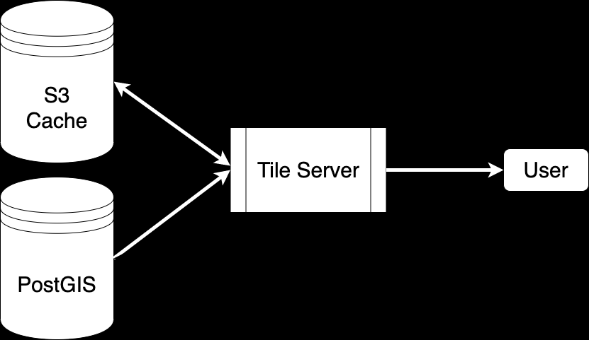
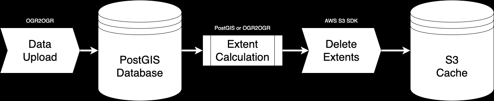

# Dynamic Map Tile Generation at Scale

Hunter Data Analytics 2022 - Jack McKew

* What are map tiles?
* Why use them?
* How to build and deliver them?

Note: Rough overview on what is covered in the talk, mention we'll go through a real world example

---

## Quick Note

This talk is open source: <https://jackmckew.github.io/hunter-data-analytics-2022-dynamic-map-tile-generation/>

Note: Mention that the presentation is live on the web and hosted on github pages

---

## Who am I

I'm Jack McKew, I'm a Snr software engineer at [Deckee](deckee.com/)

I absolutely love solving problems, especially to do with data! 📊

I have a blog on software, technology and more over at [jackmckew.dev](https://jackmckew.dev/)

You can reach me on:

* Twitter: [@jac_mcq](https://twitter.com/jac_mcq)
* LinkedIn: [jack-mckew](https://www.linkedin.com/in/jack-mckew/)
* GitHub: [@JackMcKew](https://github.com/JackMcKew)

Note: Reiterate that the talk is completely open source and links are all live

---

## Projects I work on 👥 

I'm the creator & maintainer of open source packages such as:

* [Pandas_Alive](https://github.com/JackMcKew/pandas_alive)
* [awesome-python-bytes](https://github.com/JackMcKew/awesome-python-bytes)
* Numerous GitHub Actions:
    * [pyinstaller-action-windows](https://github.com/JackMcKew/pyinstaller-action-windows)
    * [pyinstaller-action-linux](https://github.com/JackMcKew/pyinstaller-action-linux)
    * [python-interrogate-check](https://github.com/JackMcKew/python-interrogate-check)

Note: Mention github actions are used in all of these projects and more. Pandas alive almost has 20k downloads off PyPI. Show pandas_alive readme page after slide.

---

## Who's Deckee

[Deckee](deckee.com/) is the free boating app for local information, trip logging, weather, navigation aids and official alerts and notices

Note: Talk about job openings

---

## What are map tiles?

Note: Deckee ingests data from over 100+ sources to produce these specific tiles

---

## Why use map tiles?

Map tiles enable splitting up the world into smaller chunks.

---

### So many tiles

---
### Projection hell

Robinson vs Mercator

Note: Mercator is used from sailing for constant true direction means that the straight line connecting any two points on the map is the same direction that a compass would show.

---
## Types of map tiles

* Raster

* Vector

---

## Raster

---

## Vector

---
## Why can't data stay the same 😡

Maps change every second of every day in some way, especially on the water

USCG publishes changes every day to their ~55,000 points spread across the Americas

---
## Tile servers

* Tegola
* T rex
* Raw files (tippecanoe)
* Map tiler
* Mapbox Tiling Service (MTS)

> Deckee uses Tegola

---

## How Deckee builds tiles

---
## Cache management

---

## Live Demo 😬

---
## That's all folks

Feel free to reach out to me on:

* My Blog: [jackmckew.dev](https://jackmckew.dev/)
* Twitter: [@jac_mcq](https://twitter.com/jac_mcq)
* LinkedIn: [jack-mckew](https://www.linkedin.com/in/jack-mckew/)
* GitHub: [@JackMcKew](https://github.com/JackMcKew)
